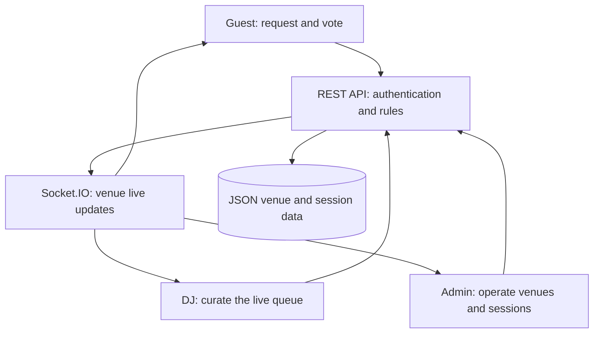
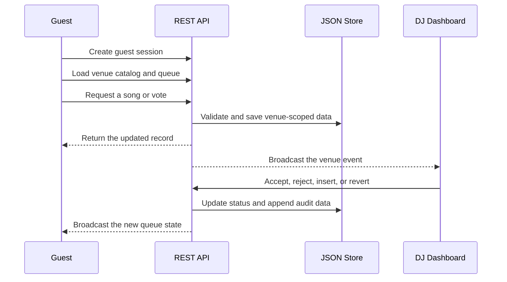
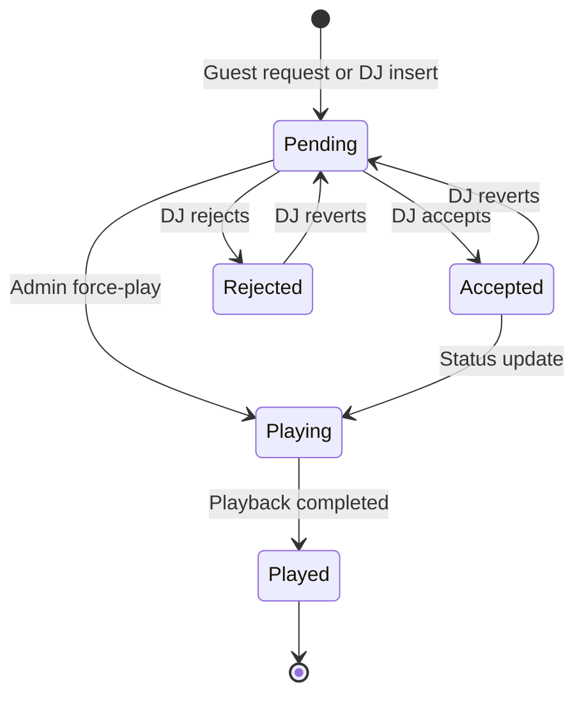
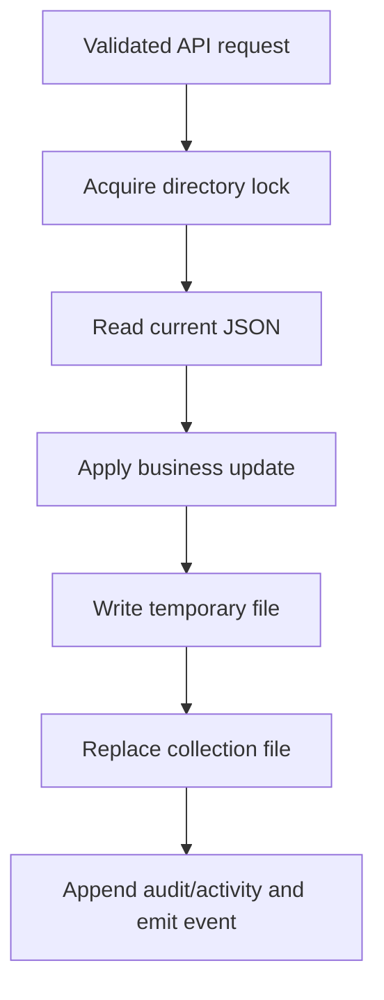

<div align="center">

# 🎚️ DJ Music Ecosystem

<p><strong>A real-time music request, crowd-voting, DJ control, and venue-management platform</strong></p>

The **DJ Music Ecosystem** connects guests, DJs, and venue administrators through three purpose-built web experiences. Guests request and vote for songs, DJs manage the live queue, and administrators control venues, music catalogs, live sessions, analytics, users, polls, and system settings.

[](https://react.dev/)
[](https://www.typescriptlang.org/)
[](https://vite.dev/)
[](https://nodejs.org/)
[](https://expressjs.com/)
[](https://socket.io/)
[](#data-and-persistence)

**[See the interface](#visual-tour)** · **[Understand the architecture](#system-architecture)** · **[Run the project](#getting-started)** · **[Explore the API](#api-at-a-glance)**

</div>

---

<p align="center">
  
</p>

> [!NOTE]
> The screenshot above is the guest-facing experience. Every interface image stored in this repository is embedded later in this README, so visitors can understand the complete system without opening the image files separately.

## Project at a glance

| Area | What is included |
|---|---|
| User experiences | Separate guest, DJ, and administrator React applications |
| Live communication | Venue-scoped Socket.IO rooms and event broadcasts |
| Backend | TypeScript, Node.js, Express, JWT authentication, and role permissions |
| Data layer | A custom file-based JSON persistence layer with atomic updates and audit records |
| Music catalog | **4,916 catalog entries** organized across **26 genres** |
| Backend surface | **78 REST route handlers** across authentication, queue, songs, venues, polls, users, analytics, sessions, and system control |
| Repository visuals | **11 full interface screenshots**, all displayed inline below |
| Project scope | Music-request coordination and venue operations; no audio files or music-streaming engine are included |

This README was prepared from the repository's `main` branch at commit `815398e` on **6 August 2026**. Counts and implementation notes refer to that audited snapshot.

## Why this system exists

In a busy club, lounge, event, or private venue, music requests are often difficult to organize. Guests may repeatedly approach the DJ, popular requests can be missed, and venue managers have little visibility into what the audience wants.

The DJ Music Ecosystem turns that informal process into a clear digital workflow:

1. A venue creates its profile and chooses the songs available to request.
2. A DJ receives approval and starts a live venue session.
3. Guests open a venue-specific link or scan a QR code.
4. Guests request songs and vote for the requests they prefer.
5. The live queue updates for connected users, DJs, and administrators.
6. The DJ keeps creative control by accepting, rejecting, inserting, or restoring requests.
7. Administrators supervise the venue, users, queue, polls, activity, and system state.

The result is a more organized audience experience without removing the DJ's final decision-making role.

## One ecosystem, three experiences



| Role | Main goal | Typical actions |
|---|---|---|
| Guest | Participate in the venue's music selection | Open a venue link, browse available songs, submit a request, vote, and watch the live queue |
| DJ | Turn audience demand into a playable set | Request access, enter an authentication key, monitor trends, accept or reject requests, add a song, and review request history |
| Administrator | Configure and supervise the full operation | Manage venues, DJs, songs, queues, polls, users, analytics, system modes, logs, QR links, and settings |

## Core experience flow



The queue is intentionally **venue-scoped**. When a live session ID is available, the guest and DJ applications also add that ID to requests so activity can be associated with a particular DJ session.

## Visual tour

The screenshots contain captured interface values for demonstration. Numbers such as vote totals, users, requests, and chart values show what the interface can present; they are not a promise that the current JSON collection files contain the same live records.

### 1. Guest song request and voting page

The guest page is mobile-oriented and designed to be opened from a venue-specific QR link. A guest can select a genre, select an available song, add it to the queue, see the leading requests, and vote for a preferred song. The page also reacts to live/maintenance state and the current live session.

<p align="center">
  
</p>

### 2. DJ access and login page

The DJ entry page accepts a username and authentication key. It also supports an access-request workflow: a DJ can request access, wait for administrator approval, and receive a venue assignment. Session checks help prevent two different DJs from controlling the same active venue session.

<p align="center">
  
</p>

### 3. DJ command center

The DJ dashboard brings together request totals, vote totals, active genres, an insert-song action, a genre chart, trending requests, the remaining queue, and accepted/rejected history. Live events keep the screen synchronized with guest and administrator actions.

<p align="center">
  
</p>

### 4. Administrator overview dashboard

The main administrator dashboard provides a quick operational summary: songs, requests, votes, users, polls, recent activity, genre distribution, top songs, and time-based activity charts. The active venue context determines which venue the administrator is viewing and controlling.

<p align="center">
  
</p>

### 5. Live control panel

The control page exposes the operational controls required during an event. It includes live mode, maintenance mode, override mode, DJ session visibility, queue priority/status actions, force-play controls, and an emergency queue-clear action.

<p align="center">
  
</p>

### 6. Song management

The song-management view supports venue-specific catalog administration. The interface includes search, filters, status controls, adding and editing songs, bulk operations, CSV-oriented import/export controls, and access to the central music database.

<p align="center">
  
</p>

### 7. Playback analytics

The playback analytics page presents summary cards and visual breakdowns for plays, active songs, time-based listening patterns, genre distribution, and the most- and least-played tracks. The backend exposes analytics snapshot endpoints, while the frontend provides the chart-rich presentation layer.

<p align="center">
  
</p>

### 8. Poll analytics and poll management

Administrators can create venue/session polls, associate songs with a poll, record votes, review vote distribution, and close a poll. The page combines high-level poll statistics with individual live-poll cards.

<p align="center">
  
</p>

### 9. User monitoring

The monitoring page summarizes active users, request and vote activity, and flagged accounts. Administrator actions can flag or unflag a user for spam-related review through protected backend routes.

<p align="center">
  
</p>

### 10. History and activity logs

The history page provides a searchable and filterable view of system activity. It is intended to help administrators understand song changes, queue decisions, imports, overrides, poll activity, and other operational events.

<p align="center">
  
</p>

### 11. System and venue configuration

This is the central configuration workspace. It contains venue profiles, venue selection, DJ records and keys, DJ access requests, guest and DJ QR information, notification settings, user limits, cooldowns, backup preferences, and saved venue details.

<p align="center">
  
</p>

## Feature map

### Guest experience

- Creates an anonymous guest JWT session and refreshes it when required.
- Reads the venue ID from `?venue=<venue-id>`.
- Resolves the public venue and its active live session.
- Loads only enabled songs assigned to that venue.
- Filters the song list by genre and song selection.
- Submits a venue-scoped request for a valid catalog song.
- Votes on pending queue items.
- Receives real-time request, vote, queue-status, DJ, and song-catalog events.
- Shows a full-screen status overlay when the system is not live, is in maintenance, or has no active live session.
- Uses responsive animation, particles, musical notes, gradients, and mobile optimization components.

### DJ experience

- Supports a username/authentication-key login flow.
- Supports a pending access-request workflow and administrator approval/denial updates.
- Associates an approved DJ with a venue and live session.
- Maintains DJ session information in browser session storage.
- Shows request, vote, and genre metrics.
- Visualizes genre distribution and the top five trending requests.
- Accepts, rejects, and reverts queue decisions.
- Inserts a song from the venue catalog into the pending queue.
- Displays accepted and rejected request history.
- Suspends the live session during normal logout and can end it explicitly.
- Responds to venue-scoped Socket.IO events so the queue changes without a page refresh.

### Administrator experience

- Provides login, signup, token refresh, and password-change flows.
- Switches between multiple venue profiles and sets an active venue.
- Creates, edits, and soft-deletes venues.
- Creates DJ profiles, generates or changes authentication keys, authenticates DJs, and removes DJ accounts.
- Reviews and approves or denies DJ access requests.
- Tracks active, suspended, and ended live sessions.
- Imports, exports, filters, creates, edits, disables, blocks, and removes venue songs.
- Copies songs from the central genre catalog into a venue-specific catalog.
- Creates, votes on, closes, and analyzes polls.
- Changes queue status and priority, force-plays a queue item, and clears a venue queue.
- Switches live, maintenance, and override modes.
- Views activity logs, user activity, analytics snapshots, and backup metadata.
- Flags or unflags users for moderation review.
- Produces guest and DJ QR entry information.
- Configures notifications, usage limits, request cooldowns, wait time, and backup preferences.

## Queue lifecycle



The canonical backend queue statuses are:

| Status | Meaning |
|---|---|
| `pending` | Waiting for a DJ or administrator decision |
| `accepted` | Approved by the DJ |
| `rejected` | Declined by the DJ |
| `playing` | Selected for current playback/force-play state |
| `played` | Completed item retained for history or analytics |

Queue priority is numeric in the backend. The administrator UI maps `normal`, `high`, and `override` to increasing priority levels.

## System architecture

### Frontend layer

The repository contains three separate React/Vite workspaces:

| Workspace | Source directory | Purpose |
|---|---|---|
| Guest app | `frontend/user/` | Venue-specific song requests and voting |
| DJ app | `frontend/dj/` | DJ access, trends, queue decisions, and live-session controls |
| Admin app | `frontend/admin/` | Venue administration, catalog management, analytics, monitoring, and control |

Each app contains its own `package.json`, Vite configuration, UI components, API client, styling, and build output. The large `components/ui/` folders are reusable Radix/shadcn-style interface primitives such as dialogs, selects, tables, tabs, tooltips, sheets, switches, and forms.

The root `frontend/shell/` directory is an integration scaffold intended to mount all three roles under `/admin`, `/dj`, and `/queue`. In the audited snapshot it still imports an older `frontend/apps/...` layout, while the actual applications live in `frontend/admin`, `frontend/dj`, and `frontend/user`. See [Source readiness and validation](#source-readiness-and-validation) before using that shell.

### Backend layer

The backend is an ECMAScript-module TypeScript application:

- `backend/src/app.ts` creates the Express app, JSON body parser, CORS middleware, request logging, routes, and error handler.
- `backend/src/index.ts` bootstraps storage, starts the HTTP server, initializes Socket.IO, and starts the song-catalog watcher.
- `backend/src/routes/` contains the REST business logic.
- `backend/src/middleware/` contains JWT authentication, permissions, and error handling.
- `backend/src/services/` contains audit, activity-log, permissions, and song-catalog services.
- `backend/src/socket/io.ts` manages administrator, venue, and DJ-access Socket.IO rooms.
- `backend/src/storage/` provides paths, file bootstrapping, directory locking, JSON reads/writes, and atomic updates.
- `backend/dist/` contains compiled JavaScript generated from the TypeScript source.

### Authentication and permissions

The API issues access and refresh JWTs for three roles:

| Role | Authentication | Permission style |
|---|---|---|
| `public` | Anonymous guest session | Catalog read, queue read, request, and vote |
| `dj` | Username plus DJ authentication key | DJ basics, catalog read, queue insert/accept/reject/revert/vote |
| `admin` | Administrator username/email and password | `admin.full`, which satisfies protected administrator permissions |

Passwords for administrator accounts are hashed with `bcryptjs`. Access-token and refresh-token durations are configurable through environment variables. Frontend API clients proactively refresh near-expiry tokens and retry selected unauthorized requests.

## Data and persistence

This project uses a custom JSON storage engine rather than MongoDB, PostgreSQL, or another external database server. That keeps local setup simple and makes the stored structures easy to inspect.

### How a write is handled



The storage implementation uses temporary files and rename-based replacement for writes. `updateJsonAtomically` protects read-modify-write operations with an in-process directory lock, which is especially useful for vote increments. Records can carry creation/update metadata, record versions, actor information, and soft-deletion timestamps.

### Stored collections

| Area | Files and responsibility |
|---|---|
| Venue operations | `venues.json`, `settings.json`, `system_config.json`, `system_mode.json` |
| Music | `songs.json`, `venue_song_selections.json` |
| Queue | `queue_items.json` |
| Polling | `polls.json`, `poll_songs.json`, `poll_votes.json` |
| People and sessions | `users.json`, `djs.json`, `dj_access_requests.json`, `live_sessions.json` |
| Reporting | `analytics_snapshots.json`, `activity_logs.json`, `audit/audit_log.json` |
| Supporting records | `assets.json`, `backups.json` |
| Authentication | `admin_accounts.json`, `anonymous_sessions.json`, `refresh_tokens.json`, `jti_denylist.json`, `permissions.json` |
| Metadata | `_meta/schema.json`, `_meta/migrations.json` |

> [!IMPORTANT]
> File locking is local to one Node.js process. For horizontal scaling across multiple backend instances, move operational data to a shared transactional database or add a cross-process locking strategy.

### Central song catalog

`backend/songs_by_genre.json` is the central title/artist metadata catalog. The backend service caches it, watches it for changes, and exposes administrator and venue-selection endpoints. Identical copies are present in the backend source and administrator public/build directories for packaging purposes.

| Genre | Entries | Genre | Entries | Genre | Entries |
|---|---:|---|---:|---|---:|
| Rock | 198 | Hip Hop | 161 | Electronic | 143 |
| Jazz | 200 | Classical | 200 | Country | 171 |
| R&B | 199 | Indie | 192 | Folk | 195 |
| Metal | 200 | Dance | 200 | Reggae | 195 |
| Blues | 187 | Soul | 190 | Alternative | 200 |
| Punk | 198 | House | 160 | Techno | 199 |
| Ambient | 200 | Acoustic | 191 | Instrumental | 196 |
| Latin | 198 | Gospel | 176 | World | 169 |
| Funk | 199 | Pop | 199 | **Total** | **4,916** |

The catalog stores song metadata only. Audio files, streaming-provider integrations, playback devices, and rights-management logic are outside this repository. Anyone deploying the system is responsible for using music and metadata in accordance with the applicable licenses, platform rules, and local laws.

### Analytics and models

The project contains chart components, analytics pages, counters, and JSON analytics-snapshot storage. It does **not** contain a trained machine-learning model, model weights, or an automated recommendation engine. Rankings are produced from application data such as votes, genres, queue state, and recorded play counts.

## Real-time communication

Socket.IO is used to avoid manual refreshes. Clients join a venue room, the administrator joins a global administrator room, and a pending DJ access request can use its own request-specific room.

| Event group | Main server events |
|---|---|
| Connection | `connected` |
| Guest queue | `queue.request.created`, `queue.vote.updated`, `queue.item.updated` |
| DJ queue | `dj.queue.inserted`, `dj.queue.accepted`, `dj.queue.rejected`, `dj.queue.reverted` |
| Admin queue | `admin.queue.priority.updated`, `admin.queue.cleared` |
| Songs | `venue.songs.updated`, `songs.database.updated` |
| Polls | `polls.updated` |
| Venue | `venue.created`, `venue.updated`, `venue.deleted`, `venue.active.updated` |
| DJ access | `dj.access.requested`, `dj.access.approved`, `dj.access.denied`, `dj.account.deleted` |
| Live sessions | `live_session.started`, `live_session.suspended`, `live_session.ended` |
| System | `admin.system_mode.updated`, `admin.settings.updated` |
| Activity | `activity_logs.updated` |

Payloads commonly include `venueId`, the affected record or ID, and metadata such as version, actor, or update time. Venue rooms prevent ordinary updates for one venue from being sent to every other venue room; the administrator room receives operational updates across venues.

## API at a glance

The current TypeScript source defines **78 route handlers**. The table below groups the active routes so a new contributor can quickly find the correct backend file.

| Domain | Main endpoints | Access |
|---|---|---|
| Authentication | `POST /auth/admin/login`, `/auth/admin/signup`, `/auth/admin/password`, `/auth/dj/login`, `/auth/guest`, `/auth/refresh`, `/auth/logout` | Mixed public and authenticated |
| Queue | `GET /queue`, `/queue/all`; `POST /queue/request`, `/queue/insert`, `/queue/force-play`; `PATCH /queue/vote`, `/queue/accept`, `/queue/reject`, `/queue/revert`, `/queue/:id/status`, `/queue/:id/priority`; `DELETE /queue/:id`, `/queue` | Public, DJ, and admin by permission |
| Songs | `GET /songs`, `/songs/catalog`, `/songs/genres`, `/songs/by-genre`, `/songs/search`, `/songs/database`, `/songs/database/raw`; `POST /songs`, `/songs/bulk`, `/songs/selection`; `PATCH /songs/:id`, `/songs/bulk-status`; `DELETE /songs/:id` | Catalog read for guests/DJs; management for admin |
| Polls | `GET /polls`; `POST /polls`; `PATCH /polls/:id/close`, `/polls/:id/vote` | Admin permission in the current backend |
| Venues | `GET /venue`, `/venues/public/:id`, `/venues`; `POST /venues`; `PATCH /venue`, `/venue/active`, `/venues/:id`; `DELETE /venues/:id` | Public lookup plus admin management |
| DJs and access | `GET /djs`, `/djs/:id`, `/djs/me/venue`, `/dj-access-requests`; `POST /djs`, `/dj-access-request`; `PATCH /djs/:id/auth-key`, `/djs/:id/authenticate`, `/dj-access-requests/:id/approve`, `/dj-access-requests/:id/deny`; `DELETE /djs/:id` | Public request, DJ self-lookup, admin management |
| Live sessions | `GET /live-sessions`, `/live-sessions/active`; `PATCH /live-sessions/:id/end`, `/suspend` | Mixed public/DJ/admin |
| System | `GET /system-mode`, `/system-config`; `PATCH /system-mode`, `/system-config`, `/settings/wait-time` | Public mode read; admin writes |
| Users | `GET /users/activity`, `/users/avatar`; `PATCH /users/:id/flag-spam`, `/unflag-spam` | Admin monitoring plus optional public asset access |
| Reporting | `GET /analytics`, `/analytics/playback`, `/activity-logs`; `POST /activity-logs`; `DELETE /activity-logs/:id` | Admin |
| Supporting data | `GET /assets/image`, `/backup/download` | Permission-controlled |
| History | `GET /history/accepted`, `/history/rejected` | Authenticated history permission |

Most operational endpoints require a `venue_id` query parameter or body field. Queue, poll, and history routes can also use `live_session_id` to narrow activity to one event session.

Additional repository contracts are available in:

- [`backend/contracts/rest.md`](backend/contracts/rest.md)
- [`backend/contracts/socket-events.md`](backend/contracts/socket-events.md)
- [`backend/contracts/enums.md`](backend/contracts/enums.md)
- [`backend/integration/`](backend/integration/)

The source code remains the final reference when a contract note and a current handler differ.

## Technology stack

| Layer | Main technology | Use in this project |
|---|---|---|
| UI framework | React 18 | Guest, DJ, and administrator interfaces |
| Language | TypeScript / TSX | Backend and frontend application code |
| Build tooling | Vite 6, SWC, Terser | Development servers and optimized frontend bundles |
| Routing | React Router | Administrator pages and unified-shell routing concept |
| UI primitives | Radix UI and shadcn-style components | Accessible dialogs, menus, forms, tables, tooltips, and controls |
| Motion | Motion / Framer Motion package | Animated cards, backgrounds, transitions, and feedback |
| Charts | Recharts | Activity, genre, trend, playback, user, and poll visualizations |
| Icons | Lucide React | Interface icon system |
| QR generation | `qr-code-styling` | Guest venue and DJ entry QR visuals in system configuration |
| Backend runtime | Node.js and Express | REST API and application services |
| Real-time layer | Socket.IO | Venue, admin, DJ-access, queue, song, and session updates |
| Authentication | JSON Web Tokens and bcryptjs | Access/refresh tokens and administrator password hashes |
| Logging | Pino and pino-http | Structured application and HTTP request logs |
| Persistence | JSON files with local locks | Human-readable, no-server local data storage |

## Repository structure

```text
DJ-Music-Ecosystem/
├── Dashboard View/                 # 11 screenshots embedded in this README
│   ├── User page.png
│   ├── Login Page.png
│   ├── DJ Control Page.png
│   └── Admin ... Page.png
├── backend/
│   ├── src/
│   │   ├── config/                 # Environment configuration
│   │   ├── middleware/             # JWT authorization and errors
│   │   ├── routes/                 # 78 Express route handlers
│   │   ├── services/               # Audit, activity, permissions, catalog
│   │   ├── socket/                 # Socket.IO rooms and emit helpers
│   │   ├── storage/                # JSON store, locks, paths, bootstrap
│   │   ├── utils/                  # IDs, records, and time helpers
│   │   ├── app.ts
│   │   └── index.ts
│   ├── db/
│   │   ├── auth/                   # Accounts, sessions, permissions, tokens
│   │   ├── collections/            # Operational JSON collections
│   │   ├── audit/                  # Audit history
│   │   └── _meta/                  # Schema and migration metadata
│   ├── contracts/                  # REST, enum, and socket notes
│   ├── integration/                # Role integration maps/checklists
│   ├── dist/                       # Compiled backend JavaScript
│   ├── songs_by_genre.json         # Central 26-genre catalog
│   ├── admin.json                  # Admin feature-mapping artifact
│   ├── dj.json                     # DJ feature-mapping artifact
│   ├── queue.json                  # Guest feature-mapping artifact
│   ├── unified.json                # Consolidated integration specification
│   └── package.json
├── frontend/
│   ├── user/                       # Guest React application
│   │   ├── src/
│   │   ├── build/                  # Generated guest build
│   │   └── package.json
│   ├── dj/                         # DJ React application
│   │   ├── src/
│   │   └── package.json
│   ├── admin/                      # Administrator React application
│   │   ├── src/
│   │   ├── public/                 # Public catalog copy
│   │   ├── build/                  # Committed admin build snapshot
│   │   └── package.json
│   ├── shell/                      # Unified-routing integration scaffold
│   ├── dist/                       # Generated root-shell build snapshot
│   └── package.json
└── README.md
```

Generated `build/`, `dist/`, and package-lock files are included in the audited repository. The editable implementation lives primarily in `backend/src/` and each role application's `src/` directory.

## Getting started

### Prerequisites

- [Node.js](https://nodejs.org/) **20 LTS or newer**
- npm
- Git
- Four terminal windows if all independent applications will run together

### 1. Clone the repository

```bash
git clone https://github.com/Agnibha-31/DJ-Music-Ecosystem.git
cd DJ-Music-Ecosystem
```

### 2. Configure and start the backend

```bash
cd backend
npm ci
```

Create `backend/.env`:

```dotenv
PORT=4000
JWT_SECRET=replace_with_a_long_random_secret
JWT_REFRESH_SECRET=replace_with_a_different_long_random_secret
JWT_ACCESS_TTL=15m
JWT_REFRESH_TTL=30d
DB_PATH=./db
```

Use unique, high-entropy values for both JWT secrets. The source contains development fallback strings only to make configuration behavior explicit; they should not be used for a real deployment.

Start the development server:

```bash
npm run dev
```

The API and Socket.IO server will listen on `http://localhost:4000` unless `PORT` is changed.

### 3. Configure the frontend applications

Create a `.env.local` file inside each of these directories:

- `frontend/user/`
- `frontend/dj/`
- `frontend/admin/`

Use:

```dotenv
VITE_API_BASE_URL=http://localhost:4000
VITE_SOCKET_URL=http://localhost:4000
```

For the administrator app, also add the DJ entry base URL:

```dotenv
VITE_DJ_APP_URL=http://localhost:3001
```

The environment variables are important because the current frontend fallback URL is `http://localhost:3000`, while the backend defaults to port `4000`.

### 4. Start the guest application

In a new terminal:

```bash
cd DJ-Music-Ecosystem/frontend/user
npm ci
npm run dev -- --port 3000
```

The guest app requires a venue query parameter:

```text
http://localhost:3000/?venue=<venue-id>
```

It will display an invalid-link message when the `venue` parameter is missing. A useful guest session also requires that the venue has enabled songs, the system is live, and an active DJ live session exists.

### 5. Start the DJ application

In another terminal:

```bash
cd DJ-Music-Ecosystem/frontend/dj
npm ci
npm run dev -- --port 3001
```

Open:

```text
http://localhost:3001/dj/login
```

The DJ must already exist or submit an access request, and an administrator must approve the venue assignment before the full command center becomes available.

### 6. Prepare the administrator source

The administrator interface is fully represented in the source tree, screenshots, and committed build snapshot. Two source-integration items should be completed before rebuilding it from a clean install:

1. Add compatible router packages to `frontend/admin/package.json`:

   ```bash
   npm install react-router@7.13.0 react-router-dom@7.13.0
   ```

2. Restore `frontend/admin/src/utils/venueApiClient.ts`. `AdminContext.tsx` imports this module and calls `loadSongsByVenue`, `addSongToVenue`, `updateSongInVenue`, `deleteSongFromVenue`, `bulkImportSongsToVenue`, and `bulkUpdateSongStatusInVenue`. The module is referenced by the current source but is not included in the audited commit.

After those integration items are resolved:

```bash
cd DJ-Music-Ecosystem/frontend/admin
npm install
npm run dev -- --port 3002
```

Open:

```text
http://localhost:3002/login
```

> [!TIP]
> The guest QR URL in `SystemConfig.tsx` currently uses the administrator page's origin because the design assumes a unified same-origin deployment. When developing the three apps on separate ports, open or share the guest URL from port `3000` manually. In production, either serve the guest and administrator routes through one origin or make the guest application base URL configurable.

### 7. First-use operating order

Once the administrator source integration is complete, the easiest operating sequence is:

1. Create an administrator account.
2. Create a venue and set it as active.
3. Select genres or songs from the central catalog for that venue.
4. Create a DJ profile and authentication key.
5. Have the DJ request access and approve the request for the venue.
6. Switch the system to live mode.
7. Open the guest URL containing the venue ID.
8. Submit requests and votes, then manage them from the DJ and administrator views.

## Build commands

| Package | Development | Production build |
|---|---|---|
| Backend | `cd backend && npm run dev` | `cd backend && npm run build && npm start` |
| Guest | `cd frontend/user && npm run dev -- --port 3000` | `cd frontend/user && npm run build` |
| DJ | `cd frontend/dj && npm run dev -- --port 3001` | `cd frontend/dj && npm run build` |
| Admin | `cd frontend/admin && npm run dev -- --port 3002` | `cd frontend/admin && npm run build` after the integration items above |

## Source readiness and validation

The following checks were performed from a clean dependency installation while preparing this README:

| Area | Result | Detail |
|---|---|---|
| Backend TypeScript build | Passed | `npm run build` completed successfully |
| Guest production build | Passed | Vite transformed and emitted the guest build successfully |
| DJ production build | Passed | Vite emitted the build; it also reported a bundle-size optimization notice for the main chunk |
| Admin production build | Integration attention | The missing `react-router-dom` declaration was found first; after adding compatible router packages, the absent `src/utils/venueApiClient.ts` import was the remaining build blocker |
| Root unified shell | Integration scaffold | Imports still target `frontend/apps/...`, which is not the current directory layout |
| Automated tests | Future enhancement | No committed unit, integration, or browser test suite was found in the audited snapshot |

These notes are included so that contributors can begin with an accurate picture of the repository rather than spending time diagnosing folder or dependency differences. The backend, guest application, and DJ application already provide a strong buildable foundation; completing the two frontend integration points will make the complete source workflow much easier to reproduce.

## Production deployment checklist

Before using the ecosystem for a real venue or public event, complete the following safeguards:

- Replace both fallback JWT secrets with long, independent production secrets.
- Restrict or remove public administrator signup after the first trusted administrator is provisioned.
- Restrict Express and Socket.IO CORS origins to the deployed frontend domains.
- Authenticate Socket.IO connections and authorize `join_admin`, `join_venue`, and DJ-access room membership on the server.
- Apply rate limits to login, guest-session, request, vote, and access-request endpoints.
- Validate and sanitize request bodies with a schema-validation library.
- Review refresh-token revocation and JWT deny-list enforcement end to end.
- Remove the hard-coded development password from `backend/gen_hash.js`, then rotate any credential that may have used it.
- Keep runtime authentication/session data out of source control and deploy with fresh, sanitized database files.
- Serve every application through HTTPS and use secure reverse-proxy headers.
- Add structured log redaction so credentials, tokens, and personal information are not written to logs.
- Store backups outside the live application directory and test restoration regularly.
- Use a transactional/shared database before running more than one backend process.
- Add automated API, permissions, WebSocket, and browser end-to-end tests.
- Rebuild frontend assets with the correct production `VITE_API_BASE_URL`, `VITE_SOCKET_URL`, and application URLs.
- Confirm that the guest QR code resolves to the guest application rather than the administrator origin.

## Extending the ecosystem

The current structure can be adapted for many venue and event use cases, including:

- Multiple clubs or branches under one administration portal.
- Wedding, festival, conference, college, and private-event request systems.
- Spotify, Apple Music, YouTube Music, or DJ-software metadata integration where platform terms permit it.
- QR posters and table-specific entry points.
- Guest profiles, request limits, abuse prevention, and loyalty programs.
- Advanced reporting dashboards and scheduled exports.
- Cloud database migration and multi-instance deployment.
- Push notifications for accepted requests or poll results.
- Moderated public polls and genre-based event themes.
- A recommendation service added as a separate, clearly documented module.

When adding a feature, preserve the existing venue boundary: REST reads/writes, Socket.IO room membership, audit records, and frontend state should all use the same `venue_id` and, when appropriate, `live_session_id`.

## Troubleshooting

| Symptom | Likely cause | What to check |
|---|---|---|
| Guest page says the QR link is invalid | No `venue` query parameter | Open `/?venue=<venue-id>` |
| Guest page stays behind a status overlay | System is not live, maintenance is active, or no live session exists | Check system mode and approve/start a DJ session |
| Frontend requests go to port 3000 | Frontend environment file is missing | Set `VITE_API_BASE_URL=http://localhost:4000` and restart Vite |
| Live updates do not appear | Socket URL, CORS, or room join is incorrect | Check `VITE_SOCKET_URL`, browser console, backend log, and `join_venue` payload |
| A requested song is rejected by the API | Song is not assigned to that venue | Add/select the song in the venue catalog first |
| DJ receives `invalid_credentials` | DJ key is wrong or the account is not authenticated | Review the DJ record and administrator approval state |
| Venue reports another active DJ | The venue already has an active session | End/suspend the existing session or use the assigned DJ |
| Admin build cannot resolve React Router DOM | Dependency is not declared in the admin package | Install the pinned compatible router packages shown above |
| Admin build cannot resolve `venueApiClient` | Referenced utility file is absent | Restore the adapter expected by `AdminContext.tsx` |
| Data appears under the wrong venue | A request omitted or reused `venue_id` | Trace the active venue through the frontend request and backend route |

## Documentation and attribution

Repository-level implementation notes are organized under `backend/contracts/` and `backend/integration/`. Feature-mapping artifacts (`admin.json`, `dj.json`, `queue.json`, and `unified.json`) describe the intended relationship between interface actions, endpoints, fields, and real-time requirements.

The frontend attribution files identify shadcn/ui-derived components used under the MIT license and Unsplash resources under the Unsplash license:

- [`frontend/admin/src/Attributions.md`](frontend/admin/src/Attributions.md)
- [`frontend/dj/src/Attributions.md`](frontend/dj/src/Attributions.md)

Third-party packages and resources remain subject to their respective licenses and terms.

## Project use and licensing

This repository is publicly available for demonstration, evaluation, learning, and collaboration. A dedicated root-level license file can be added to state the project's formal reuse and distribution terms clearly. Until those terms are published, individuals and organizations interested in adapting, deploying, or building upon the ecosystem are encouraged to discuss their intended use with the developer.

## Developer

**Agnibha Basak**  
GitHub: [@Agnibha-31](https://github.com/Agnibha-31)  
Email: [remix.play31@gmail.com](mailto:remix.play31@gmail.com?subject=DJ%20Music%20Ecosystem%20Enquiry)  
Gmail users: [Open a new message](https://mail.google.com/mail/?view=cm&fs=1&to=remix.play31%40gmail.com&su=DJ%20Music%20Ecosystem%20Enquiry)

For venue dashboards, real-time systems, custom business platforms, deployment support, or a tailored version of this ecosystem, use either email link above to open a pre-addressed message.
